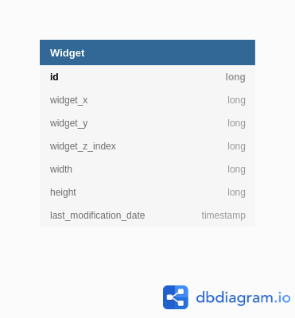

# Widget Management API

Application responsible for managing Widgets that customers are using on a board.
The service stores only widgets, assuming that all clients work with the same board.

The REST API was constructed using the **SpringBoot** framework.  

## Getting started

### Dependencies

To run the application, install the latest versions (except Java, which must be version 11) 
of the following applications:

- [Java 11](https://www.java.com/pt_BR/download/)
- [Maven](https://maven.apache.org/)

### Building

Maven is used to build the backend SpringBoot API, running the following command:

`mvn package`

### Testing 

Both Unit and Integration tests were written for the API. Running integrated tests of SpringBoot 
applications requires loading the entire Spring context, which slows down the process of running these tests. 
Thus, separate ways of executing unit and integrated tests were created. 

Unit tests were made using JUnit, to run them use the command:

`mvn test`

The Integrated Tests were built using the TestRestTemplate abstraction, which allows to emulate the execution of REST 
requests to the API, allowing the creation of tests that validate all application layers. 
To run the unit and integrated tests use the command:

`mvn integration-test`

### Running 

To run the backend SpringBoot API, run:

 `mvn spring-boot:run`

The Backend API endpoints were generated and documented using [Swagger](https://swagger.io/). The swagger documentation
is located on `/src/main/resources/swagger.yaml`, use [Swagger Editor](https://editor.swagger.io/) to visualize it.

## Definitions

A Widget is an object on a plane in a ​ Cartesian coordinate system that has coordinates (X, Y),
Z-index, width, height, last modification date, and a ​unique identifier​. A Z-index ​ is a unique sequence common to 
all widgets that determines the order of widgets (regardless of their coordinates). Gaps are allowed.​ 
The higher the value, the higher the widget lies on the plane.

### Database Design

The following figure is a Diagram for the Widget Entity.

Two persistence repositories where implemented, in-Memory and using a H2 SQL Database. The **control of which
repository is used** by the application is done by setting the **spring.profiles.active** field to either **memory** or **sql**
on **application.properties** file.

### Backend API Design

The Backend API exposes the following endpoints:

- POST ​/widgets => Creates a Widget. Having a set of coordinates, Z-index, width, and height, we get a complete 
                   widget description in the response. The server generates the identifier. If a Z-index is not 
                   specified, the widget moves to the foreground (becomes maximum). If the existing Z-index is 
                   specified, then the new widget shifts widget with the same (and greater if needed) upwards.
                   
- GET ​​/widgets => Gets list of Widgets data sorted by Z-index value in ascending order. The search is Paginated.
                  Default current Page is 0 and Page Size is 10. Page Size maximum value is 500.
                  
- GET ​/widgets/{id} => Find data of Widget associated with given id.

- PUT /widgets/{id} => Changes Widget data of Widget associated with given id. In response, we get an updated full 
                       description of the widget. We cannot change the widget id. The rules related to the Z-index are the
                       same as when creating a widget.

- DELETE /widgets/{id} => Deletes Widget associated with given id.