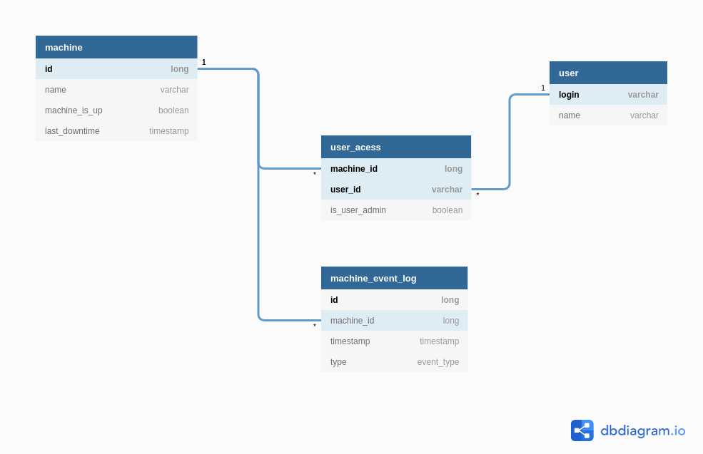

# Machine Monitor System

Application responsible for monitoring the usage of a group of computers, recording any downtime of the machines.
The system also manages the creation of machines and users, and granting and revoking users acess to the machines.

The REST API was constructed using the **SpringBoot** framework.  

## Getting started

### Dependencies

To run the application, install the lastest versions (except Java, which must be version 8) 
of the following applications:

- [Java 8](https://www.java.com/pt_BR/download/)
- [Maven](https://maven.apache.org/)

### Building

Maven is used to build the backend SpringBoot API, running the following command:

`mvn package`

### Testing 

Both Unit and Integration tests were written for the SpringBoot backend API. Running integrated tests of SpringBoot 
applications requires loading the entire Spring context, which slows down the process of running these tests. 
Thus, separate ways of executing unit and integrated tests were created. 

Unit tests were made using JUnit, to run them use the command:

`mvn test`

The Integrated Tests were built using the TestRestTemplate abstraction, which allows to emulate the execution of REST 
requests to the API, allowing the creation of tests that validate all application layers. 
To run the unit and integrated tests use the command:

`mvn integration-test`

### Running 

To run the backend SpringBoot API, run:

 `mvn spring-boot:run`

The Backend API endpoints were generated and documented using [Swagger](https://swagger.io/). The swagger documentation
is located on `/src/main/resources/swagger.yaml`, use [Swagger Editor](https://editor.swagger.io/) to visualize it.

## Definitions

### Database Design

The following figure is the ER Diagram for the system.

The system manages two Entities: Machines and Users. A user can have acess to 0 or more machines, and machines have 1 or 
more Users who can acess them, this succumbs to a Many To Many relationship, maintained in the user_acess table. The 
user_acess table also stores if the user is the admin user of the machine, each machine has only one admin user, and a user
can be the admin user of 0 or more machines. Every time the state of a machine (Running or Down) changes, this event is 
recorded in the Machine Event Log Entity. The machine also keeps track of it's last downtime. 

### Backend API Design

The Backend API exposes the following endpoints:

- PUT ​/machines => Creates or edits data of a machine.
- GET ​/machines => Gets monitoring data from all machines.
- GET /machines​/{id} => Find machine data by ID.
- PUT ​/users => Creates a user of a machine.
- GET /users => Gets data from all the Users.
- GET /users​/{login} => Find User data by Login.
- PUT /users​/acess​/request => Requests a user to have acess to certain machine.
- DELETE ​/users​/acess​/request => Revokes the acess of a user to a certain machine.